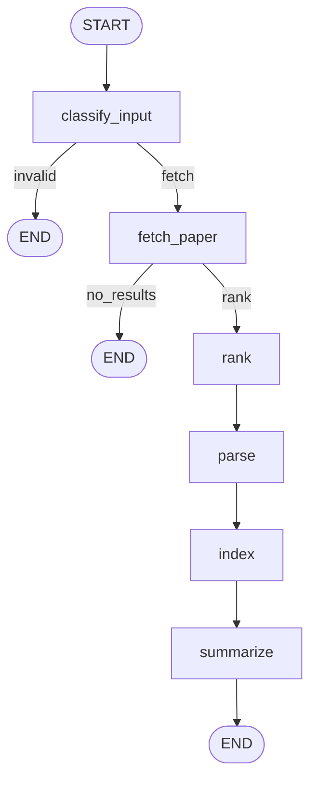

# arXiv Paper Digest & QA Agent

You give it an arXiv ID, an arXiv link, or a research topic. It finds the paper, reads the full PDF, writes a structured briefing, and then lets you ask questions about the paper. Answers come only from the paper's text, and if the paper doesn't cover something, it says so instead of making something up.

It is built as a LangGraph state graph in Python, with arXiv, PyMuPDF, Chroma, Gemini and Groq.

---

## Setup

You need Python 3.12, [uv](https://docs.astral.sh/uv/), and two free API keys:

- Gemini (Google AI Studio): https://aistudio.google.com/apikey
- Groq: https://console.groq.com/keys

arXiv and the embedding model don't need a key.

```bash
git clone https://github.com/Hethshah12/8-BYTE-AI.git
cd 8-BYTE-AI
uv sync
cp .env.example .env      # on Windows PowerShell: Copy-Item .env.example .env
```

Then fill in `.env`:

```ini
GOOGLE_API_KEY=your_key
GROQ_API_KEY=your_key
GEMINI_MODEL=gemini-3.8-flash
GEMINI_FALLBACK_MODEL=gemini-2.5-flash
GROQ_MODEL=openai/gpt-oss-120b
```

Model names on the free tiers change often. If one gets rejected (404, or a 429 that says `limit: 0`), swap in another model your key can use.

The first run downloads the embedding model (all-MiniLM-L6-v2, about 90 MB). The `HF_TOKEN` warning you'll see is harmless.

## Running it

```bash
uv run python -m byte_8_ai.cli 1706.03762
uv run python -m byte_8_ai.cli https://arxiv.org/abs/1706.03762
uv run python -m byte_8_ai.cli "data poisoning attacks on large language models"
```

The briefing gets printed and also saved to `data/briefings/<id>.json`. After that you can type questions; press Enter on an empty line to quit.

Everything generated goes into `data/` (git-ignored): the downloaded PDFs, the parsed Markdown, the Chroma database and the saved briefings.

### Rate limits you might hit while testing

- **arXiv**: asks for at most 1 request every 3 seconds. I use a single shared client so that delay is respected, but running the agent many times in a row still got me HTTP 429s. When that happens the agent prints the error and stops cleanly.
- **Gemini free tier**: returned 503 "high demand" a few times. It retries, then switches to the fallback Gemini model.
- **Groq free tier**: has per-model limits (check your console). If QA fails, you get a "QA model not available" message instead of a crash.

---

## How it works

### The graph



Questions use a second, one-node graph (`START -> qa -> END`) that runs once per question. I kept it separate because the digest runs once, while questions come in one at a time from the user.

| Node | Reads | Writes |
|---|---|---|
| classify_input | user_input | mode, arxiv_id or search_query |
| fetch_paper | mode, arxiv_id / search_query | candidates |
| rank | candidates | selected_paper |
| parse | selected_paper | pdf_path, parsed_path, parsed_quality |
| index | parsed_path, selected_paper | collection_name |
| summarize | parsed_path, parsed_quality, selected_paper | briefing |
| qa | messages, collection_name | messages |

The state is a TypedDict (`AgentState`). A run starts with only `user_input` and each node adds its own keys. `errors` and `messages` have reducers, so nodes append to them instead of overwriting each other. Data that comes from outside the program (arXiv metadata and LLM output) is checked with Pydantic models (`PaperMetadata`, `Briefing`).

### What each step does

**classify_input** - A regex finds an arXiv ID anywhere in the input, so plain IDs, `arXiv:` prefixes and full URLs all work. Old-style IDs like `hep-th/9901001` are handled too. I used a regex instead of an LLM because this has an exact answer, and a regex is instant, free and predictable. It also correctly treats "2024 advances in RAG" as a topic, even though it starts with numbers.

**fetch_paper** - Calls the arXiv API (by ID, or a search for topics). `services/arxiv_cl.py` turns arXiv's results into my `PaperMetadata` model. No results or an API error means the graph ends with a clear message. I checked live that an unknown ID returns an empty list, not an error.

**rank** - Picks the first result. arXiv already sorts by relevance, and for "KV cache compression" the top result (PolyKV) was relevant.

**parse** - Downloads the PDF, checks it really is a PDF (it has to start with `%PDF`; arXiv can send an HTML error page, and PyMuPDF opens that without complaining), and converts it to Markdown with pymupdf4llm (max 50 pages, OCR off). If there's no PDF link, the download fails, the file is broken, or there's almost no text (a scanned PDF), it writes the abstract into the same output file instead and marks `parsed_quality = "abstract_only"`. PDFs are cached, and a broken one is deleted so it can't be reused.

**index** - Removes the references section, splits the text at each heading, cuts sections into 150-word chunks with 40 words of overlap, and stores them in Chroma (one collection per paper, cosine distance). Each chunk keeps its section name. If the paper is already indexed, this step is skipped.

**summarize** - Sends the whole paper (references removed) to Gemini in one call and gets back a `Briefing` through `with_structured_output`. The schema rejects an empty limitations list, so the model can't skip it. Retries once, and falls back to a second Gemini model if the first one is unavailable.

**qa** - Finds the 4 closest chunks to the question, then applies two checks:
1. If even the closest chunk has a cosine distance above 0.75, it answers "not in the paper" without calling the LLM at all.
2. Otherwise Groq answers using only those chunks, cites sections in brackets, and has to say "not in the paper" if the chunks don't contain the answer.

Every answer ends with the sections it used and their distances, so you can see where it came from.

---

## Example run

On 1706.03762 ("Attention Is All You Need"). Briefing, shortened:

```text
-----Attention Is All You Need-----
Ashish Vaswani, Noam Shazeer, Niki Parmar, Jakob Uszkoreit, Llion Jones, Aidan N. Gomez,
Lukasz Kaiser, Illia Polosukhin | arxiv 1706.03762 | 2017-06-12

KEY FINDINGS
  - The Transformer (big model) achieved a new state-of-the-art BLEU score of 28.4 on the
    WMT 2014 English-to-German translation task, outperforming previous best models
    (including ensembles) by over 2.0 BLEU.
  - On WMT 2014 English-to-French, the big model set a new single-model state-of-the-art
    BLEU score of 41.8, training for 3.5 days on eight GPUs ...
  - The base model (27.3 BLEU on EN-DE) also surpassed all previously published models
    and ensembles ...

LIMITATIONS
  - The O(n^2 * d) computational complexity of self-attention can be a bottleneck for very
    long sequences ...
  - Reducing the attention key size (d_k) hurts model quality, suggesting a more
    sophisticated compatibility function could be beneficial.
  ...
```

I checked the numbers against the paper by hand: 28.4 and 41.8 BLEU, the base model's 27.3 BLEU, 8 P100 GPUs, the N=6 / d_model=512 / h=8 settings, the parsing F1 scores (91.3 and 92.7) and the comparisons with BerkeleyParser and RNNG all match. An earlier version of the briefing said the Transformer became "the foundation of modern NLP", which is true but isn't in the 2017 paper, so I added a rule to the prompt against describing the paper's later impact.

QA:

```text

### QA session
### OUTPUT
(byte-8-ai) PS C:\Byte_8_AI\Byte_8_AI> uv run python -m byte_8_ai.cli 1706.03762
Warning: You are sending unauthenticated requests to the HF Hub. Please set a HF_TOKEN to enable higher rate limits and faster downloads.
Loading weights: 100%|██████████████████████████████████████████████████████████████████████████████████████████████████████| 103/103 [00:00<00:00, 2872.26it/s]
Direct use of automatic function calling (AFC) in Models.generate_content is not recommended. Instead, we recommend to use AFC in Chat.send_message. Similarly, direct use of AFC in Models.generate_content_stream is not recommended. Instead, we recommend to use AFC in Chat.send_message_stream.

 -----Attention Is All You Need-----
Ashish Vaswani, Noam Shazeer, Niki Parmar, Jakob Uszkoreit, Llion Jones, Aidan N. Gomez, Lukasz Kaiser, Illia Polosukhin | arxiv 1706.03762| 2017-06-12
https://arxiv.org/abs/1706.03762

WHY IT MATTERS
This paper introduces the Transformer, a novel network architecture that entirely eschews recurrence and convolutions, relying solely on attention mechanisms. This approach significantly improves parallelization, leading to substantially faster training times compared to previous state-of-the-art models. For instance, it achieves new state-of-the-art results on machine translation tasks (WMT 2014 English-to-German and English-to-French) at a fraction of the training cost, making advanced sequence transduction models more accessible and efficient.

PROBLEM
Dominant sequence transduction models, based on recurrent or convolutional neural networks, suffer from inherent sequential computation, which precludes parallelization within training examples and becomes critical at longer sequence lengths. Existing attention mechanisms are typically used in conjunction with recurrentnetworks, and convolutional approaches struggle with learning dependencies between distant positions, requiring a growing number of operations with distance.

METHOD
  - The Transformer is an encoder-decoder architecture composed of stacked self-attention and point-wise, fully connected layers, entirely dispensing with recurrence and convolutions.
  - The encoder consists of N=6 identical layers, each with two sub-layers: a multi-head self-attention mechanism and a position-wise fully connected feed-forward network. Residual connections and layer normalization are applied around each sub-layer, with all sub-layers and embedding layers producing outputs of dimension d_model = 512.
  - The decoder also has N=6 identical layers, adding a third sub-layer that performs multi-head attention over the encoder's output. The decoder's self-attention sub-layer is masked to prevent attending to subsequent positions, preserving the auto-regressive property.
  - Attention is implemented as 'Scaled Dot-Product Attention', where queries, keys, and values are vectors. Dot products of queries with keys are computed, scaled by 1/√d_k, and a softmax function is applied to obtain weights for a weighted sum of values.
  - Multi-Head Attention projects queries, keys, and values 'h' times with different learned linear projections, performs attention in parallel, and concatenates the results. The model uses h=8 parallel attention layers, with d_k = d_v = d_model / h = 64 for each head, maintaining similar computational cost to single-head attention.
  - Positional encodings, using sine and cosine functions of different frequencies, are added to input embeddings to inject information about token order, as the model lacks recurrence or convolution.
  - Training uses the Adam optimizer with a specific learning rate schedule (linear warmup for 4000 steps, then inverse square root decay) and regularization techniques including residual dropout (P_drop = 0.1 for base model) and label smoothing (ϵ_ls = 0.1).

KEY FINDINGS
  - The Transformer (big model) achieved a new state-of-the-art BLEU score of 28.4 on the WMT 2014 English-to-German translation task, outperforming previous best models (including ensembles) by over 2.0 BLEU.
  - On the WMT 2014 English-to-French translation task, the Transformer (big model) established a new single-model state-of-the-art BLEU score of 41.8, trainingfor 3.5 days on eight GPUs, which is a small fraction (<1/4) of the training costs of the best models from the literature.
  - The base Transformer model (27.3 BLEU on EN-DE) also surpassed all previously published models and ensembles, demonstrating high performance at a significantly reduced training cost (3.3 * 10^18 FLOPs for EN-DE base vs. 9.6 * 10^18 FLOPs for ConvS2S).
  - The Transformer generalizes well to other tasks, achieving 91.3 F1 on English constituency parsing (WSJ only) and 92.7 F1 in a semi-supervised setting, outperforming the BerkeleyParser (90.4 F1) even with limited training data.
  - Self-attention layers connect all positions with a constant number of sequential operations (O(1)), offering significant parallelization advantages over recurrent layers (O(n) sequential operations) and convolutional layers (O(n/k) or O(logk(n)) path length).
  - Model variations showed that single-head attention performed 0.9 BLEU worse than the optimal multi-head configuration, and reducing the attention key size (d_k) negatively impacted model quality. Bigger models generally performed better, and dropout was crucial for preventing overfitting.

LIMITATIONS
  - The O(n^2 * d) computational complexity of self-attention can be a bottleneck for very long sequences, requiring future investigation into restricted attention mechanisms to improve performance.
  - The dot-product compatibility function may not be optimal, as reducing the attention key size (d_k) hurts model quality, suggesting that a more sophisticated compatibility function could be beneficial.
  - The model's performance is sensitive to the number of attention heads (h), with both too few and too many heads leading to a drop in quality.
  - While performing well on English constituency parsing, the Transformer did not achieve the absolute state-of-the-art, being slightly outperformed by the Recurrent Neural Network Grammar (92.7 F1 vs 93.3 F1 in the semi-supervised setting).

SUGGESTED QUESTIONS
  - How would the Transformer perform on tasks involving input and output modalities other than text, such as images, audio, or video?
  - What are the performance implications of using local, restricted attention mechanisms for efficiently handling very large inputs and outputs?
  - Can the generation process in the decoder be made less sequential, and what impact would this have on overall efficiency and performance?
  - Would a more sophisticated compatibility function than the scaled dot product improve model quality, particularly when the attention key size (d_k) is constrained?

Briefing saved to C:\Byte_8_AI\Byte_8_AI\data\briefings\1706.03762.json

 Ask any questions related to the paper (To quit just hit Enter)how are images, audio or video handled?
The authors propose to handle images, audio, and video by extending the Transformer to non‑text modalities and by investigating **local, restricted attention mechanisms** that can process these large‑scale inputs and outputs efficiently【7 Conclusion】. This approach aims to replace recurrent layers with attention‑basedprocessing for such data types.

 Ask any questions related to the paper (To quit just hit Enter)what is the computational complexity of the self-attention model?
{NOT_IN_PAPER}

 Ask any questions related to the paper (To quit just hit Enter)bottleneck time complexity?
{NOT_IN_PAPER}

 Ask any questions related to the paper (To quit just hit Enter)BLEU score in the paper?
The paper reports that the big Transformer achieves a BLEU score of **28.4** on the WMT 2014 English‑to‑German test and **41.0** (≈41.8 in the table) on English‑to‑French, while the base Transformer reaches **27.3** (EN‑DE) and **38.1** (EN‑FR) BLEU scores【6.1 Machine Translation】.

```text
Ask about the paper (Enter to quit): How many attention heads does the model use?
<paste real answer>

Ask about the paper (Enter to quit): What hardware was used for training?
<paste real answer>

Ask about the paper (Enter to quit): What is the recipe for chocolate cake?
I couldn't find this in the paper.
```

---

## Design decisions and tradeoffs

**A graph instead of one big prompt.** Each step does one thing, and failures can be routed (end the graph, or fall back) instead of getting lost inside a single prompt. The cost is more code and wiring.

**Two LLM providers, split by job.** Gemini does the summary because its context window fits a whole paper in one call, so I didn't need to summarize in pieces and lose connections between sections. Groq does QA because it's fast and QA prompts are small. Which provider is used where is decided only in `config.get_llm(role)`. The summary's fallback is a second Gemini model rather than Groq, because Groq's free tier can't take a whole paper in one request.

**Metadata never goes through the LLM.** Title, authors, date and link come straight from arXiv. The `Briefing` model only has the analysis fields, so the LLM can't get the metadata wrong.

**The state stores file paths, not the paper.** `parsed_path` and `collection_name` point to files on disk. That keeps the state small and lets me rerun or debug any step on its own.

**When parsing fails, the abstract goes into the same file.** That way index and summarize don't need a special case; `parsed_quality` is the only thing that changes.

**Chunking by section.** Chunks never mix two sections, which is what makes the section citations in answers possible. 150 words stays under the embedding model's input limit, beyond which text is cut off without any warning.

**Two checks for grounding.** I measured distances on 1706.03762: a clearly relevant question scored 0.37, a valid but short question (training hardware) 0.67, and an off-topic one (chocolate cake) 0.82. The distance check alone is fragile because 0.67 and 0.82 are close, and the prompt rule alone costs an LLM call for every off-topic question. Using both, obvious misses are free and subtle ones are still caught.

**Errors are returned, not raised.** Nodes add to `errors` and the routers decide whether to continue. I catch specific exceptions where I know them (arxiv, requests, pymupdf, groq). The one exception is the Gemini call in summarize, which catches everything, because the error types differ between Google's library, LangChain and the fallback wrapper, and a clear message is better than a crash there.

**How state gets from the summary to QA.** The CLI keeps the final digest state in memory and passes it to the QA graph with each question; the conversation is kept in `messages`. The heavy parts (PDF, parsed text, embeddings) are on disk, so running the same paper again skips downloading and indexing. The QA conversation itself isn't saved between sessions.

---

## Known limitations

- Only arXiv papers are supported (other sources were out of scope).
- Ranking just takes arXiv's first result. There's no re-ranking, and "recent" in a query is ignored.
- The 0.75 distance cutoff is based on a handful of questions from one paper. One real miss: I asked about the computational complexity of self-attention and got "not in the paper", even though Table 1 and Section 4 cover it. Tables and math often come out garbled from PDFs, which is my best guess at the cause.
- Reference removal is a regex tested on two formats (inline bold and a heading). Papers that use "Bibliography" or other styles may keep their references.
- PDF extraction leaves small artifacts (missing spaces like "usedin", broken URLs, garbled equations).
- If you change the chunk settings, delete `data/chroma/` first. Otherwise the "already indexed" check reuses the old chunks.
- Output changes a bit from run to run even at temperature 0, and the CLI doesn't show whether the main or the fallback Gemini model wrote the briefing.

## What I'd do with more time

1. Save QA sessions with LangGraph's SQLite checkpointer so a conversation can be resumed.
2. Re-rank topic search results by embedding similarity, and handle "recent" queries by date.
3. Add keyword search (BM25) next to embeddings, so exact names and numbers match reliably.
4. Build a small labelled set of questions per paper to tune the distance cutoff properly.
5. Cache briefings and record which model produced each one.

---

## Project layout

```text
src/byte_8_ai/
  state.py          PaperMetadata, Briefing (Pydantic), AgentState (TypedDict)
  config.py         loads .env, get_llm(role)
  graph.py          digest graph, QA graph, routers
  cli.py            entry point
  nodes/            classify, retrieve, parse, index, summarize, qa
  services/         arxiv_cl (arXiv adapter), pdf_tools, vector_store (Chroma)
```

Services handle I/O and don't know about the graph. Nodes read the state, call the services and decide what the results mean. `graph.py` only connects them.